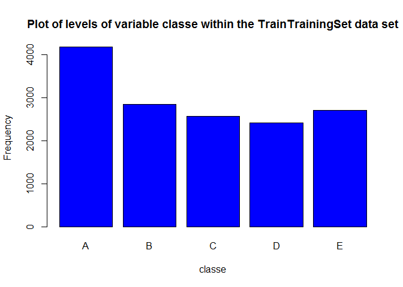
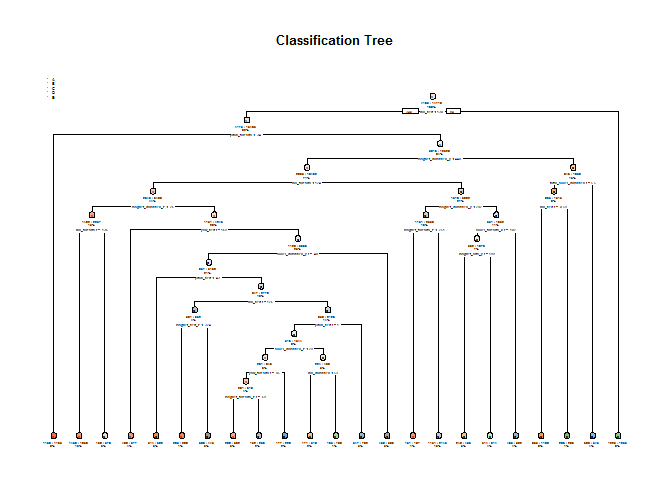

Scripts have been produced and tested on RSudio Version 1.0.143 and
Windows 7.

This document is the Final Project for "Practical Machine Learning""
from Johns Hopkins University.

(Background, Data and What you should submit sections are directly
copied from course's assignement page)

Background
==========

Using devices such as Jawbone Up, Nike FuelBand, and Fitbit it is now
possible to collect a large amount of data about personal activity
relatively inexpensively. These type of devices are part of the
quantified self movement - a group of enthusiasts who take measurements
about themselves regularly to improve their health, to find patterns in
their behavior, or because they are tech geeks. One thing that people
regularly do is quantify how much of a particular activity they do, but
they rarely quantify how well they do it. In this project, your goal
will be to use data from accelerometers on the belt, forearm, arm, and
dumbell of 6 participants. They were asked to perform barbell lifts
correctly and incorrectly in 5 different ways. More information is
available from the website here:
<http://groupware.les.inf.puc-rio.br/har> (see the section on the Weight
Lifting Exercise Dataset).

Data
====

The training data for this project are available here:

\[<https://d396qusza40orc.cloudfront.net/predmachlearn/pml-training.csv>\]

The test data are available here:

\[<https://d396qusza40orc.cloudfront.net/predmachlearn/pml-testing.csv>\]

The data for this project come from this source:
\[<http://groupware.les.inf.puc-rio.br/har>\]. If you use the document
you create for this class for any purpose please cite them as they have
been very generous in allowing their data to be used for this kind of
assignment.

What you should submit
======================

The goal of your project is to predict the manner in which they did the
exercise. This is the "classe" variable in the training set. You may use
any of the other variables to predict with. You should create a report
describing how you built your model, how you used cross validation, what
you think the expected out of sample error is, and why you made the
choices you did. You will also use your prediction model to predict 20
different test cases.

Your submission should consist of a link to a Github repo with your R
markdown and compiled HTML file describing your analysis. Please
constrain the text of the writeup to &lt; 2000 words and the number of
figures to be less than 5. It will make it easier for the graders if you
submit a repo with a gh-pages branch so the HTML page can be viewed
online (and you always want to make it easy on graders :-). You should
also apply your machine learning algorithm to the 20 test cases
available in the test data above. Please submit your predictions in
appropriate format to the programming assignment for automated grading.
See the programming assignment for additional details.

Approach:
=========

Our outcome variable is classe, a factor variable. For this data set,
"participants were asked to perform one set of 10 repetitions of the
Unilateral Dumbbell Biceps Curl in 5 different fashions: - exactly
according to the specification (Class A) - throwing the elbows to the
front (Class B) - lifting the dumbbell only halfway (Class C) - lowering
the dumbbell only halfway (Class D) - throwing the hips to the front
(Class E)

Two models will be tested using decision tree and random forest. The
model with the highest accuracy will be chosen as our final model.

Cross-validation
----------------

Cross-validation will be performed by subsampling our training data set
randomly without replacement into 2 subsamples: TrainTrainingSet data
(75% of the original Training data set) and TestTrainingSet data (25%).
Our models will be fitted on the TrainTrainingSet data set, and tested
on the TestTrainingSet data. Once the most accurate model is choosen, it
will be tested on the original Testing data set.

Expected out-of-sample error
----------------------------

The expected out-of-sample error will correspond to the quantity:
1-accuracy in the cross-validation data. Accuracy is the proportion of
correct classified observation over the total sample in the
TestTrainingSet data set. Expected accuracy is the expected accuracy in
the out-of-sample data set (i.e. original testing data set). Thus, the
expected value of the out-of-sample error will correspond to the
expected number of missclassified observations/total observations in the
Test data set, which is the quantity: 1-accuracy found from the
cross-validation data set.

Our outcome variable "classe" is a factor variable. We split the
Training dataset into TrainTrainingSet and TestTrainingSet datasets.

Install packages and load the required libraries

    # install.packages("caret"); install.packages("randomForest"); install.packages("rpart"); 
    library(lattice); library(ggplot2); library(caret); library(randomForest); library(rpart); library(rpart.plot);

    ## Warning: package 'ggplot2' was built under R version 3.3.3

    ## Warning: package 'caret' was built under R version 3.3.3

    ## Warning: package 'randomForest' was built under R version 3.3.3

    ## randomForest 4.6-12

    ## Type rfNews() to see new features/changes/bug fixes.

    ## 
    ## Attaching package: 'randomForest'

    ## The following object is masked from 'package:ggplot2':
    ## 
    ##     margin

    ## Warning: package 'rpart' was built under R version 3.3.3

    ## Warning: package 'rpart.plot' was built under R version 3.3.3

    set.seed(1234)

    # data load and clean up
    trainingset <- read.csv("pml-training.csv", na.strings=c("NA","#DIV/0!", ""))
    testingset <- read.csv("pml-testing.csv", na.strings=c("NA","#DIV/0!", ""))

    # Perform exploratory analysis - 
    # dim(trainingset); dim(testingset); summary(trainingset); summary(testingset); str(trainingset); str(testingset); head(trainingset); head(testingset);               

    # Delete columns with all missing values
    trainingset<-trainingset[,colSums(is.na(trainingset)) == 0]
    testingset <-testingset[,colSums(is.na(testingset)) == 0]

    # Delete variables are irrelevant to our current project: user_name, raw_timestamp_part_1, raw_timestamp_part_,2 cvtd_timestamp, new_window, and  num_window (columns 1 to 7). 
    trainingset   <-trainingset[,-c(1:7)]
    testingset <-testingset[,-c(1:7)]

    # partition the data so that 75% of the training dataset into training and the remaining 25% to testing
    traintrainset <- createDataPartition(y=trainingset$classe, p=0.75, list=FALSE)
    TrainTrainingSet <- trainingset[traintrainset, ] 
    TestTrainingSet <- trainingset[-traintrainset, ]

    # The variable "classe" contains 5 levels: A, B, C, D and E. A plot of the outcome variable will allow us to see the frequency of each levels in the TrainTrainingSet data set and # compare one another.

    plot(TrainTrainingSet$classe, col="blue", main="Plot of levels of variable classe within the TrainTrainingSet data set", xlab="classe", ylab="Frequency")

Based on the graph above, we can see that each level frequency is within
the same order of magnitude of each other. Level A is the most frequent
while level D is the least frequent.

Prediction model 1: Decision Tree
=================================

    model1 <- rpart(classe ~ ., data=TrainTrainingSet, method="class")

    prediction1 <- predict(model1, TestTrainingSet, type = "class")

    # Plot the Decision Tree
    rpart.plot(model1, main="Classification Tree", extra=102, under=TRUE, faclen=0)

    # Test results on our TestTrainingSet data set:
    confusionMatrix(prediction1, TestTrainingSet$classe)

    ## Confusion Matrix and Statistics
    ## 
    ##           Reference
    ## Prediction    A    B    C    D    E
    ##          A 1235  157   16   50   20
    ##          B   55  568   73   80  102
    ##          C   44  125  690  118  116
    ##          D   41   64   50  508   38
    ##          E   20   35   26   48  625
    ## 
    ## Overall Statistics
    ##                                           
    ##                Accuracy : 0.7394          
    ##                  95% CI : (0.7269, 0.7516)
    ##     No Information Rate : 0.2845          
    ##     P-Value [Acc > NIR] : < 2.2e-16       
    ##                                           
    ##                   Kappa : 0.6697          
    ##  Mcnemar's Test P-Value : < 2.2e-16       
    ## 
    ## Statistics by Class:
    ## 
    ##                      Class: A Class: B Class: C Class: D Class: E
    ## Sensitivity            0.8853   0.5985   0.8070   0.6318   0.6937
    ## Specificity            0.9307   0.9216   0.9005   0.9529   0.9678
    ## Pos Pred Value         0.8356   0.6469   0.6313   0.7247   0.8289
    ## Neg Pred Value         0.9533   0.9054   0.9567   0.9296   0.9335
    ## Prevalence             0.2845   0.1935   0.1743   0.1639   0.1837
    ## Detection Rate         0.2518   0.1158   0.1407   0.1036   0.1274
    ## Detection Prevalence   0.3014   0.1790   0.2229   0.1429   0.1538
    ## Balanced Accuracy      0.9080   0.7601   0.8537   0.7924   0.8307

Prediction model 2: Random Forest
=================================

    model2 <- randomForest(classe ~. , data=TrainTrainingSet, method="class")

    # Predicting:
    prediction2 <- predict(model2, TestTrainingSet, type = "class")

    # Test results on TestTrainingSet data set:
    confusionMatrix(prediction2, TestTrainingSet$classe)

    ## Confusion Matrix and Statistics
    ## 
    ##           Reference
    ## Prediction    A    B    C    D    E
    ##          A 1395    2    0    0    0
    ##          B    0  945    9    0    0
    ##          C    0    2  844    6    0
    ##          D    0    0    2  798    0
    ##          E    0    0    0    0  901
    ## 
    ## Overall Statistics
    ##                                           
    ##                Accuracy : 0.9957          
    ##                  95% CI : (0.9935, 0.9973)
    ##     No Information Rate : 0.2845          
    ##     P-Value [Acc > NIR] : < 2.2e-16       
    ##                                           
    ##                   Kappa : 0.9946          
    ##  Mcnemar's Test P-Value : NA              
    ## 
    ## Statistics by Class:
    ## 
    ##                      Class: A Class: B Class: C Class: D Class: E
    ## Sensitivity            1.0000   0.9958   0.9871   0.9925   1.0000
    ## Specificity            0.9994   0.9977   0.9980   0.9995   1.0000
    ## Pos Pred Value         0.9986   0.9906   0.9906   0.9975   1.0000
    ## Neg Pred Value         1.0000   0.9990   0.9973   0.9985   1.0000
    ## Prevalence             0.2845   0.1935   0.1743   0.1639   0.1837
    ## Detection Rate         0.2845   0.1927   0.1721   0.1627   0.1837
    ## Detection Prevalence   0.2849   0.1945   0.1737   0.1631   0.1837
    ## Balanced Accuracy      0.9997   0.9968   0.9926   0.9960   1.0000

Decision on which Prediction Model to Use:
==========================================

Random Forest algorithm performed better than Decision Trees. Accuracy
for Random Forest model was 0.995 (95% CI: (0.993, 0.997)) compared to
Decision Tree model with 0.739 (95% CI: (0.727, 0.752)). The Random
Forests model is choosen. The expected out-of-sample error is estimated
at 0.005, or 0.5%.

Submission
==========

Here is the final outcome based on the Prediction Model 2 (Random
Forest) applied against the Testing dataset

    # predict outcome levels on the original Testing data set using Random Forest algorithm
    predictfinal <- predict(model2, testingset, type="class")
    predictfinal

    ##  1  2  3  4  5  6  7  8  9 10 11 12 13 14 15 16 17 18 19 20 
    ##  B  A  B  A  A  E  D  B  A  A  B  C  B  A  E  E  A  B  B  B 
    ## Levels: A B C D E
